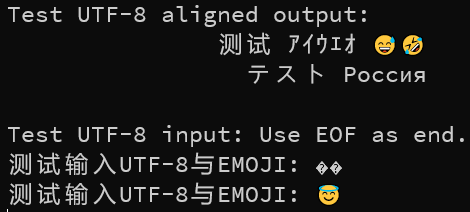

# utf8-console

Utilities for handling UTF-8 reading/writing in console.

Current this library has two components: one tool to properly handle display width of UTF-8 strings and a UTF-8-friendly `setw`  manipulator. Another is for reading UTF-8 string on Windows.



## Usage (header-only)

Grab a copy of `include_header_only/utf8_console` and `include_header_only/utfcpp`. 

## Build & Usage

The project is built using CMake and no external dependency is required. Just simply configure and build the CMake project to get  library files.

`include` directory contains public headers which should be added to your project include directories.

If you're using CMake for your project, feel free to include the whole utf8-console in your project and use the `utf8_console` target.

For a quick start, check the example below (also available in `example/example.cpp`):

```cpp
#include <iostream>
#include <iomanip>
#include <string>

#include "utf8_console.h"
using namespace std;

int main()
{
    initialize_utf8_console();

    std::string test_str1 = "测试 ｱｲｳｴｵ 😅🤣";
    std::string test_str2 = "テスト Россия";
    cout << "Test UTF-8 aligned output: " << endl
         << right << setw_u8(30, test_str1) << test_str1 << endl
         << right << setw_u8(30, test_str2) << test_str2 << endl
         << endl;

    cout << "Test UTF-8 input: Use EOF as end." << endl;
    std::string str;
    while (getline(cin, str))
        cout << str << endl;
    return 0;
}
```

## Documentation

Also check doc in `include/utf8_console.h`!

### Console width utility

#### Simple usage

For all call sites of `setw`, replace it to `setw_u8`, and specific the string you're writing as the second parameter (as `string_view`). Since `setw` status is reset after every I/O operation, you need to call `setw_u8` every time you're writing as well.

To obtain the display-width of a UTF-8 string, call `utf8_cswidth`.

#### The long story

When formatting strings containing non-ASCII UTF-8 characters using `std::setw`, strings may be misaligned due to the mismatch between the `char`s one "character" occupies and its actual display width on console. For example, CJK characters typically occupy 3 `char`s in UTF-8 but are as wide as 2 latin characters.

If the string is encoded using something like GB-18030 or Shift-JIS, a coincidence is exploited: one CJK character uses exactly 2 `char`s in those charsets. Therefore most times,  the text is properly aligned. However, such a coincidence is error-prone. For example, if halfwidth Japanese kana is outputted, the result is still incorrect.

What if we could calculate the actual display width of a string on console? Consider the formula below:

```
Specified_Width = Desired_Width + (String_Byte_Count - String_Display_Width)
```

POSIX has provided `wcwidth` and `wcswidth` function to calculate the `String_Display_Width`, but it's not available on Windows. A portable `wcwidth` implementation is included in this project. Another problem is that `wcwidth` takes one **code point** as input, so we need to convert UTF-8 string to UTF-32, so UTF8-CPP project was included to tackle this.

Factually, UTF8-CPP allows providing an OutputIterator as target, and if a custom implementation is provided, we no longer need to convert the string to UTF-32 because we only need to calculate the sum of width. Therefore the overhead of memory allocation is avoided.

### Windows UTF-8 reading fix

#### Simple usage

Call `initialize_utf8_console` at the very beginning of your program.

**Note: legacy streams like `scanf` and `stdin` is not affected!!**

Put back features of `cin` is also not implemented.

#### Long story

Upon 2022-02-24, Microsoft still didn't get the UTF-8 reading on console right on Windows. `SetConsoleCP` and `chcp` both have no effect and `cin` can just read a bunch of garbage (`NUL` or zeros) if console is feed non-ASCII characters. 

Therefore, the only way to properly read UTF-8 characters from stdin is to use UTF-16 Windows APIs (specifically `ReadConsoleW`), and convert UTF-16 strings to UTF-8.

Additionally, a custom `streambuf` is provided, and `initialize_utf8_console` will install it to the system `cin`, therefore UTF-8 characters could be read insensibly.

# License & Credits

This project is released under MIT license.

This project contains code or is inspired from:

- https://github.com/nemtrif/utfcpp
- https://github.com/termux/wcwidth
- https://stackoverflow.com/questions/29188948/cout-setw-doesnt-align-correctly-with-%C3%A5%C3%A4%C3%B6
- https://stackoverflow.com/questions/48176431/reading-utf-8-characters-from-console

